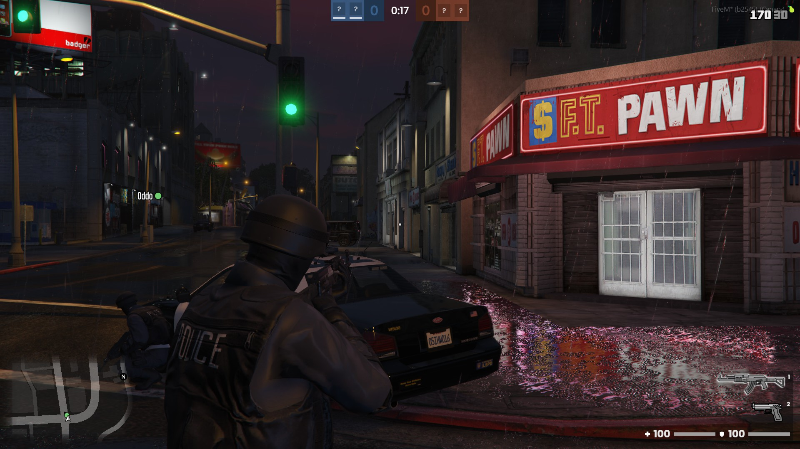

import Tabs from '@theme/Tabs';
import TabItem from '@theme/TabItem';

# cops-and-robbers

---

**A tactical team-based shooter for FiveM**



---

## Installation

### Download

After the purchase you will receive an email from Tebex containing the instructions to download the resource.

Alternatively, you can go to https://keymaster.fivem.net/asset-grants and download it.

### Setting up

1. Extract the `cops-and-robbers.pack.zip` file to a folder called `cops-and-robbers` inside your resources folder.

2. Add the following to your `server.cfg` to start the resource.

```cfg
ensure cops-and-robbers
```

3. In game you can use `cops_and_robbers` command to open Matchmaking UI.

---

## Configuration

All the configurations for the mini-game and the matchmaking are in the file config.lua. Tweak it to best suit your needs.

```lua
LOCALE = {
  LANGUAGE = 'en' -- Default language
}

GAME_CONFIG = {
  MAX_ROUNDS = 8, -- Maximum rounds of each match
  TIME_TO_ROUND_END_IN_MS = 1 * 60 * 1000, -- Time for the round to end giving victory to robbers

  TIME_TO_DESTROY_GAME = 30 * 1000, -- Timeout to clean up a game after it finishes

  DEFAULT_TIME_TO_HIDE_NOTIFICATIONS_IN_MS = 10 * 1000, -- Default time to hide notifications
  TIME_WAITED_TO_START_SPECTATING_IN_MS = 5 * 1000, -- Time after death to start spectating a teammate

  TEAM_COLORS = {
    COPS = "#39608b",
    ROBBERS = "#82412d"
  } -- Team related colors
}

MATCHMAKING_CONFIG = {
  TIME_TO_START_ROUND_IN_MS = 15 * 1000, -- Time to start the first round
  TIMEOUT_TO_START_MATCH_IN_MS = 15 * 1000, -- Timeout to start the first round after creating a match

  MAX_ITEMS_PER_PAGE = 20 -- Maximum items per page in lobby pagination
}

BUCKET_CONFIG = { -- Configuration related to FiveM routing bucket
  POPULATION_ENABLED = false,
  LOCKDOWN_MODE = 'strict'
}

INPUT_CONFIG = { -- Configuration related to FiveM key mapping
  SCOREBOARD = {
      KEY = "tab", -- Default key
      MAPPER = "keyboard", -- Default mapper (optional)
  },
  SELECT_LONG_WEAPON = {
      KEY = "1",
      MAPPER = "keyboard",
  },
  SELECT_SHORT_WEAPON = {
      KEY = "2",
      MAPPER = "keyboard",
  },
  SELECT_MELLE_WEAPON = {
      KEY = "3",
      MAPPER = "keyboard",
  },
  SPECTATE_NEXT_PLAYER = {
      KEY = "MOUSE_LEFT",
      MAPPER = "MOUSE_BUTTON",
  }
}
```

---

## Integrating

By design, we don't bake framework support in our scripts. All of our creations are standalone, but they can be easily integrated with the framework of your preference.

Here are some examples of how to integrate this script to some of the most common frameworks in the FiveM community.

<Tabs>

<TabItem value="standalone" label="Standalone">

This resource is standalone by default, so you can safely download it and put it on your server.

</TabItem>

<TabItem value="qb" label="QB">

This resource is standalone, but to make the better compatibility in qb-core need some changes in others resource, some like remove default HUD, inventory, health system and others stuffs when playing.

QB support is still a work in progress. You can stay tuned to Discord channels to know when it's out.

</TabItem>

<TabItem value="esx" label="ESX">

This resource is standalone, but to make the better compatibility in esx need some changes in others resource like HUD, inventory, health system and others stuffs when playing.

ESX support is still a work in progress. You can stay tuned to Discord channels to know when it's out.

</TabItem>

</Tabs>

---

## How to use Editor

We create a great editor for edit maps, weapons groups, outfits and much more

1. First we need configurate your permissions to open editor. See [How to management permissions](#how-to-management-permissions)

2. Now you can use this command to open Editor UI `cops_and_robbers editor`

3. Thats it for more examples see [Editor](#editor) section

---

## How to add a new Map Type

Map types are used for filtering maps in the matchmaking system. Players can select an option and find a random map for their match.

1. Go to `data/maps/` and open `types.json`.

2. Add your map type configuration. Example:

```json title="types.json"
{
  "type": "jewelry", // Type used when declaring the map
  "maxPlayersPerTeam": 6 // Max players per team
}
```

---

## How to add new Items

You can add new items to the game such weapons, armour, throwable and more.

1. First we need declare item in `data/items/items.json`.

```json title="items.json"
{
  "name": "PISTOL", // Item name used with locale system
  "hash": "WEAPON_PISTOL", // Item hash (if is a weapon or throwable needs to be same hash)
  "type": "SHORT_WEAPON", // Item type (MELLE_WEAPON | SHORT_WEAPON | LONG_WEAPON | THROWABLE)
  "icon": "data/items/icons/weapon_pistol.png", // Icon path
  "model": "w_pi_pistol", // Item model to be created in world
  "droppable": true, // Is able to drop this item
},
```

2. Right now we need to add one icon. Put this icon inside `data/items/icons`, example: `data/items/icons/weapon_dagger.png`

---

## How to add new items in Item Shop

You can add new items in item shop. Follow this steps

1. Go to file `data/items/item-shop.json`

Item shop file have a categories and items inside every category, you can create a new category or edit a added category.

2. To add a new item in some category only need define a price and item hash, like that.

```json title="item-shop.json"
{
  "categories": [
    {
      "name": "PISTOLS", // Category name
      "items": [
        // Category items
        {
          "hash": "WEAPON_PISTOL", // Item hash
          "price": 200 // Item price
        },
        {
          "hash": "WEAPON_PISTOL_MK2", // Item hash
          "price": 300 // Item price
        }
      ]
    }
  ]
}
```

---

## How to add a new Locale

Localization are used to all text in this resource.

1. Go to `data/locales` folder, and create a new json, with name to locale to be added.

2. Copy all content in `data/locales/en.json` and paste it into the json file you created.

3. Start your translation.

Also you can change the current locale in `config.lua`, see [`Configuration`](#configuration)

---

## How to management permissions

Permissions are used in editor.

We use permission system provided by Fivem, see this forum post [`Basic Aces & Principals overview/guide`](https://forum.cfx.re/t/basic-aces-principals-overview-guide/90917) for more information about how to use this permissions.

But here have a quick setup:

1. First you need add permission to user like in above example. Remember change XXXXXX to you steam HEX

```cfg
add_principal identifier.steam:XXXXXX group.admin
```

2. Add Permission to you group to access Cops and Robbers.

```cfg
# Cops and robbers editor
add_ace group.admin "cops_and_robbers.editor" allow
```

---

## Editor

Editor section

---

## Client exports

### `displayMatchmaking`

Display Matchmaking UI

```lua
exports['cops-and-robbers']:displayMatchmaking()
```

### `hideMatchmaking`

Hide Matchmaking UI

```lua
exports['cops-and-robbers']:displayMatchmaking()
```

---

## Client Events

### `copsandrobbers:matchStart`

Triggered when match started

```lua
--- @table data
--- @field mapId number
--- @field teams table
--- @field weaponGroup number
--- @field weather table

AddEventHandler("copsandrobbers:matchStarted", function(data)
  print(json.encode(data))
end)
```

### `copsandrobbers:matchFinished`

Triggered when match finished

```lua
--- @table data
--- @field winnerTeamId number

AddEventHandler("copsandrobbers:matchFinished", function(data)
  print(json.encode(data))
end)
```

### `copsandrobbers:roundStart`

Triggered when round started

```lua
--- @table data
--- @field gameId number
--- @field roundStartAt number
--- @field roundEndAt number

AddEventHandler("copsandrobbers:roundStart", function(data)
  print(json.encode(data))
end)
```

### `copsandrobbers:roundEnd`

Triggered when round end

```lua
--- @table data
--- @field winnerTeamId number
--- @field reason enum(TeamExtermination = 1, Timeout = 2)

AddEventHandler("copsandrobbers:roundEnd", function(data)
  print(json.encode(data))
end)
```

### `copsandrobbers:teamSwap`

Triggered when swap teams

```lua
AddEventHandler("copsandrobbers:teamSwap", function() end)
```

### `copsandrobbers:playerFatalDamaged`

Triggered when local player dead

```lua
AddEventHandler("copsandrobbers:playerFatalDamaged", function(culpritServerId, assistServerId, weaponHash, wasHeadshot)
  print(culpritServerId, assistServerId, weaponHash, wasHeadshot)
end)
```

### `copsandrobbers:playerRevive`

Triggered when local player revive

```lua
AddEventHandler("copsandrobbers:playerRevive", function() end)
```

### `copsandrobbers:startSpectating`

Triggered when start spectating

```lua
AddEventHandler("copsandrobbers:startSpectating", function() end)
```

### `copsandrobbers:stopSpectating`

Triggered when stop spectating

```lua
AddEventHandler("copsandrobbers:stopSpectating", function() end)
```

### `copsandrobbers:editor:started`

Triggered when start editor

```lua
AddEventHandler("copsandrobbers:editor:started", function() end)
```

### `copsandrobbers:editor:stopped`

Triggered when stop editor

```lua
AddEventHandler("copsandrobbers:editor:stopped", function() end)
```

---

## Server exports

### `getPlayerNameCallback`

```lua
---@param fn A function that is executed when get player name
exports['cops-and-robbers']:getPlayerNameCallback(function(playerServerId)
  -- TODO
end)
```

---

## Server events

### `copsandrobbers:createdMatch`

Triggered when one match is created

```lua
AddEventHandler("copsandrobbers:createdMatch", function(game)
  print(json.encode(game))
end)
```

### `copsandrobbers:matchFinished`

Triggered when one match finish

```lua
AddEventHandler("copsandrobbers:matchFinished", function(game)
  print(json.encode(game))
end)
```

### `copsandrobbers:roundStart`

Triggered when round start

```lua
--- @table data
--- @field gameId number
--- @field roundStartAt number
--- @field roundEndAt number

AddEventHandler("copsandrobbers:roundStart", function(data)
  print(json.encode(data))
end)
```

### `copsandrobbers:roundEnd`

Triggered when round end

```lua
--- @table data
--- @field gameId number
--- @field winnerTeamId number
--- @field reason enum(TeamExtermination = 1, Timeout = 2)

AddEventHandler("copsandrobbers:roundEnd", function(data)
  print(json.encode(data))
end)
```

---

## Common errors

### Error parsing script / Failed to load script

Your server artifacts are likely outdated. Update your server to version 5181 or above.

### You lack the required entitlement to use cops-and-robbers

Try restarting your server and make sure your server license key is correct. If you bought the resource on the wrong account, you can transfer it to another account on keymaster.

### Failed to verify protected resource

Files were possibly corrupted during transfer. Ensure hidden files are copied; the .fxap file in a protected resource must be included. Some FTP programs skip these files.

---

## Credits

- [pedr0fontoura](https://github.com/pedr0fontoura) for the help to develop this resource.
